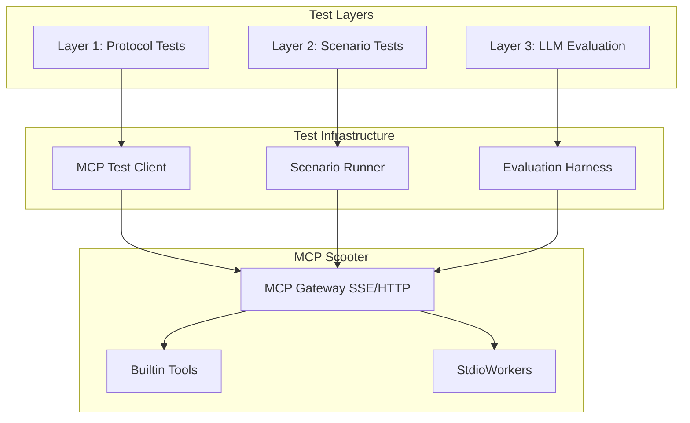

# Agent-in-the-Loop Testing Framework

## Problem Statement

MCP Scooter is a meta-MCP server that proxies to other MCP servers. When an AI agent uses Scooter (e.g., calls `scooter_add("brave-search")` then `brave_web_search(...)`), the system can "halt" silently. Current unit tests validate individual components but do not catch:

- Protocol handshake failures between agent and Scooter
- Tool name normalization issues (`brave_web_search` vs `brave-web-search`)
- Response timeouts in the proxy layer
- End-to-end agent usability

## Architecture Overview



## Key Decision: HTTP-Based Testing

Scooter runs as an HTTP server (MCP Gateway on port 3001, Control API on port 3000), not stdio. Tests will connect via HTTP/SSE to the running gateway, matching how real AI agents (Cursor, Claude Desktop) connect.

## Folder Structure

```
tests/
  README.md                    # Testing guide with instructions
  go.mod                       # Separate Go module for tests
  go.sum
  requirements.txt             # Python dependencies for LLM evaluation
  
  # Layer 1: Protocol Testing (Go)
  protocol/
    client.go                  # MCP HTTP/SSE test client
    client_test.go             # Protocol compliance tests
    
  # Layer 2: Scenario Testing (Go + YAML)
  scenarios/
    runner.go                  # Scenario execution engine
    runner_test.go             # Scenario test runner
    definitions/
      builtin_tools.yaml       # Test scooter_find, scooter_add, etc.
      brave_search.yaml        # Test brave-search integration
      tool_lifecycle.yaml      # Test add/remove/list cycle
      
  # Layer 3: LLM Evaluation (Python)
  evaluation/
    run_evaluation.py          # Wrapper script for evaluation
    scooter_eval.xml           # Scooter-specific test questions
    
  # Shared utilities
  fixtures/
    mock_mcp_server.go         # Simple mock MCP server for testing
    test_registry/             # Test registry entries
      test-tool.json
```

## Implementation Details

### 1. Remove `test-tool/` Folder

The `test-tool/main.go` is a minimal JSON-RPC ping/pong server that is not referenced anywhere in the codebase. It will be replaced by a more comprehensive mock server in `tests/fixtures/`.

**Action:** Delete `test-tool/` folder entirely.

---

### 2. Layer 1: Protocol Testing (`tests/protocol/`)

#### 2.1 MCP HTTP Client (`tests/protocol/client.go`)

A test client that connects to Scooter's MCP Gateway via HTTP/SSE:

```go
// Key types and methods
type MCPTestClient struct {
    baseURL    string        // e.g., "http://127.0.0.1:3001"
    profileID  string        // e.g., "work"
    httpClient *http.Client
    apiKey     string
}

func (c *MCPTestClient) Initialize() (*JSONRPCResponse, error)
func (c *MCPTestClient) ListTools() ([]Tool, error)
func (c *MCPTestClient) CallTool(name string, args map[string]any) (*JSONRPCResponse, error)
```

The client will:

- Send JSON-RPC requests to `POST /profiles/{id}/message`
- Handle SSE connections for `GET /profiles/{id}/sse`
- Track request/response timing for debugging
- Log all traffic for analysis

#### 2.2 Protocol Tests (`tests/protocol/client_test.go`)

Test cases that validate MCP protocol compliance:

| Test | Description |

|------|-------------|

| `TestProtocol_Initialize` | Verify handshake returns correct protocolVersion |

| `TestProtocol_ListTools` | Verify builtin tools (scooter_*) are present |

| `TestProtocol_CallBuiltinTool` | Verify scooter_find returns results |

| `TestProtocol_AddTool` | Verify scooter_add activates a tool |

| `TestProtocol_CallProxiedTool` | Verify calling a tool from an added server works |

| `TestProtocol_Timeout` | Verify graceful timeout handling |

---

### 3. Layer 2: Scenario Testing (`tests/scenarios/`)

#### 3.1 Scenario Definition Format (YAML)

```yaml
# tests/scenarios/definitions/brave_search.yaml
name: brave-search-integration
description: Tests adding and using brave-search
timeout: 120s
requires:
  env:
    - BRAVE_API_KEY
  registry:
    - brave-search
steps:
  - name: initialize
    action: initialize
    expect:
      result.protocolVersion: "2024-11-05"
      
  - name: add_brave
    action: call_tool
    tool: scooter_add
    args:
      tool_name: "brave-search"
    expect:
      error: null
      
  - name: verify_tools_added
    action: list_tools
    expect:
      tools_contain: ["brave_web_search"]
      
  - name: call_brave_search
    action: call_tool
    tool: brave_web_search
    args:
      query: "MCP protocol"
    expect:
      error: null
      result.content: not_empty
```

#### 3.2 Scenario Runner (`tests/scenarios/runner.go`)

```go
type ScenarioRunner struct {
    client    *protocol.MCPTestClient
    scenarios map[string]*Scenario
}

func (r *ScenarioRunner) LoadScenarios(dir string) error
func (r *ScenarioRunner) Run(name string) (*ScenarioResult, error)
func (r *ScenarioRunner) RunAll() ([]*ScenarioResult, error)
```

The runner will:

- Parse YAML scenario definitions
- Execute steps sequentially
- Validate expectations using JSONPath-like queries
- Generate detailed reports

---

### 4. Layer 3: LLM Evaluation (`tests/evaluation/`)

#### 4.1 Evaluation Questions (`tests/evaluation/scooter_eval.xml`)

Questions that test real agent behavior:

```xml
<evaluation>
  <qa_pair>
    <question>Use scooter_find to search for "search" tools. 
    How many tools are found? Answer with just the number.</question>
    <answer>1</answer>
  </qa_pair>
  <qa_pair>
    <question>First add the brave-search tool using scooter_add. 
    Then search for "Anthropic MCP protocol". 
    What company created MCP?</question>
    <answer>Anthropic</answer>
  </qa_pair>
  <qa_pair>
    <question>List all active tools using scooter_list_active. 
    Before adding any tools, how many are active? 
    Answer with just the number.</question>
    <answer>0</answer>
  </qa_pair>
</evaluation>
```

#### 4.2 Evaluation Runner (`tests/evaluation/run_evaluation.py`)

A wrapper script that:

1. Starts Scooter if not running
2. Connects via SSE transport
3. Runs evaluation using the existing `evaluation.py` harness
4. Generates a markdown report
```python
# Usage
python tests/evaluation/run_evaluation.py \
  --scooter-url http://127.0.0.1:3001 \
  --profile work \
  --api-key YOUR_KEY \
  --output report.md
```


---

### 5. Test Instructions (`tests/README.md`)

A comprehensive guide that lives in the tests folder:

```markdown
# MCP Scooter Testing Guide

## Prerequisites
- Go 1.21+
- Python 3.10+
- Scooter built (`make build`)
- API keys for external tools (BRAVE_API_KEY, etc.)

## Quick Start

### Run All Tests
make test-agent

### Run Protocol Tests Only
cd tests && go test ./protocol/... -v

### Run Scenario Tests
cd tests && go test ./scenarios/... -v -run TestScenario

### Run LLM Evaluation
cd tests && python evaluation/run_evaluation.py

## Test Layers

### Layer 1: Protocol Tests
Tests MCP protocol compliance without external dependencies.
- No API keys required
- Fast (< 30 seconds)
- Run: `go test ./protocol/...`

### Layer 2: Scenario Tests  
Tests specific workflows with real tool integrations.
- Requires API keys for external tools
- Medium speed (1-5 minutes)
- Run: `go test ./scenarios/... -tags=integration`

### Layer 3: LLM Evaluation
Tests real agent behavior using Claude.
- Requires ANTHROPIC_API_KEY
- Slow (5-15 minutes)
- Run: `python evaluation/run_evaluation.py`

## Environment Variables
- SCOOTER_URL: MCP Gateway URL (default: http://127.0.0.1:3001)
- SCOOTER_API_KEY: Gateway API key
- BRAVE_API_KEY: For brave-search tests
- ANTHROPIC_API_KEY: For LLM evaluation

## Writing New Tests

### Adding a Protocol Test
1. Add test function to `protocol/client_test.go`
2. Follow pattern: TestProtocol_<Feature>

### Adding a Scenario
1. Create YAML file in `scenarios/definitions/`
2. Define steps with actions and expectations
3. Run with `go test ./scenarios/... -run TestScenario/<name>`

### Adding Evaluation Questions
1. Edit `evaluation/scooter_eval.xml`
2. Follow qa_pair format with stable answers
```

---

### 6. Makefile Updates

Add new targets to the root `Makefile`:

```makefile
# Agent Testing
test-agent-protocol:
	cd tests && go test ./protocol/... -v

test-agent-scenarios:
	cd tests && go test ./scenarios/... -v -tags=integration

test-agent-eval:
	cd tests && python evaluation/run_evaluation.py

test-agent: test-agent-protocol test-agent-scenarios
	@echo "Agent tests passed!"

test-agent-full: test-agent test-agent-eval
	@echo "Full agent test suite passed!"
```

---

### 7. Mock MCP Server (`tests/fixtures/mock_mcp_server.go`)

A simple mock server for testing without external dependencies:

```go
// Implements a minimal MCP server that responds to:
// - initialize -> returns server info
// - tools/list -> returns configurable tool list
// - tools/call -> returns configurable responses

type MockMCPServer struct {
    tools     []Tool
    responses map[string]interface{}
}

func (s *MockMCPServer) Start(port int) error
func (s *MockMCPServer) Stop() error
func (s *MockMCPServer) SetToolResponse(toolName string, response interface{})
```

This replaces the functionality of `test-tool/main.go` with a more complete implementation.

---

## Files to Create

| File | Purpose |

|------|---------|

| `tests/README.md` | Testing guide and instructions |

| `tests/go.mod` | Go module for test code |

| `tests/requirements.txt` | Python dependencies |

| `tests/protocol/client.go` | MCP HTTP/SSE test client |

| `tests/protocol/client_test.go` | Protocol compliance tests |

| `tests/scenarios/runner.go` | Scenario execution engine |

| `tests/scenarios/runner_test.go` | Scenario test runner |

| `tests/scenarios/definitions/builtin_tools.yaml` | Builtin tool tests |

| `tests/scenarios/definitions/brave_search.yaml` | Brave search integration |

| `tests/scenarios/definitions/tool_lifecycle.yaml` | Add/remove cycle |

| `tests/evaluation/run_evaluation.py` | Evaluation wrapper |

| `tests/evaluation/scooter_eval.xml` | Test questions |

| `tests/fixtures/mock_mcp_server.go` | Mock MCP server |

| `tests/fixtures/test_registry/test-tool.json` | Test registry entry |

## Files to Modify

| File | Change |

|------|--------|

| `Makefile` | Add test-agent-* targets |

## Files to Delete

| File | Reason |

|------|--------|

| `test-tool/main.go` | Replaced by `tests/fixtures/mock_mcp_server.go` |

| `test-tool/` (folder) | Empty after main.go removal |

---

## Execution Order

1. Delete `test-tool/` folder
2. Create `tests/go.mod` and `tests/requirements.txt`
3. Implement `tests/protocol/client.go`
4. Implement `tests/protocol/client_test.go`
5. Implement `tests/fixtures/mock_mcp_server.go`
6. Implement `tests/scenarios/runner.go`
7. Create scenario YAML definitions
8. Implement `tests/scenarios/runner_test.go`
9. Create `tests/evaluation/scooter_eval.xml`
10. Implement `tests/evaluation/run_evaluation.py`
11. Write `tests/README.md`
12. Update root `Makefile`