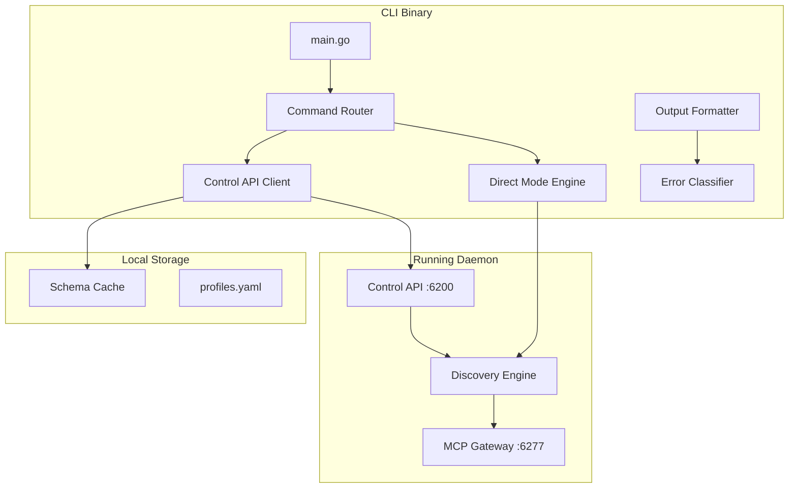

# Phase 1.5: Scooter CLI Implementation Plan

## Strategic Context

### Why This Matters

MCP Scooter is competing with MCPorter, a TypeScript CLI tool that has gained popularity by addressing the "context bloat" problem in AI agents. The YouTube video "Why MCP is dead & How I vibe now" (Jan 2026) highlighted how MCPorter enables 70%+ token reduction by using CLI commands instead of loading full MCP tool schemas into context.

**Key Insight:** MCP Scooter already solves context bloat at the protocol level through dynamic tool loading (`scooter_find` -> `scooter_activate`), which is architecturally superior to MCPorter's CLI wrapper approach. However, MCPorter has better developer experience (DX) for CLI power users.

### Competitive Analysis Summary

| Aspect | MCPorter | MCP Scooter | Gap |

|--------|----------|-------------|-----|

| Context Bloat Solution | CLI wrapper (external) | Protocol-level dynamic loading | Scooter is superior |

| CLI Experience | Excellent (`npx mcporter call ...`) | None currently | **Gap to close** |

| Skills/Catalog | Manual skill creation | Schema defined, catalog planned | Scooter ahead |

| Profile Isolation | None | First-class feature | Scooter ahead |

| Error Handling | Excellent classification | Basic | **Learn from MCPorter** |

| Result Formatting | `.text()`, `.json()` helpers | None | **Learn from MCPorter** |

### What We're Building

A Go-based CLI (`scooter`) that:

1. Communicates with the running Scooter daemon via Control API
2. Provides `npx @mcp-scooter/cli` experience similar to MCPorter
3. Adopts MCPorter's excellent error classification and result formatting
4. Leverages Scooter's existing infrastructure (profiles, registry, gateway)

### CLI Architecture



### Two Operating Modes

1. **Daemon Mode** (default): CLI talks to running Scooter daemon via Control API
2. **Direct Mode** (`--direct`): CLI initializes its own DiscoveryEngine (for headless servers without GUI)

---

## Current Codebase State

### Existing Architecture

```
cmd/
├── scooter/              # Desktop app entry point (starts HTTP servers)
│   └── main.go
└── validate-registry/    # Registry validation CLI
    └── main.go

internal/
├── api/
│   ├── server.go         # Control API (:6200) + MCP Gateway (:6277)
│   └── mcp.go            # MCP protocol handling
├── domain/
│   ├── discovery/        # Tool discovery engine
│   │   ├── builtin.go    # Primordial tools (scooter_find, scooter_activate)
│   │   ├── discovery.go  # Core discovery logic
│   │   └── interpreter.go # Code interpreter (goja)
│   ├── profile/          # Profile management
│   └── registry/         # Registry types and validation
└── logger/               # Logging infrastructure
```

### Key Files to Reference

- **[cmd/scooter/main.go](cmd/scooter/main.go)**: Current entry point, starts Control API on port 6200 and MCP Gateway on port 6277
- **[internal/api/server.go](internal/api/server.go)**: Control API endpoints (profiles, settings, tools)
- **[internal/domain/discovery/builtin.go](internal/domain/discovery/builtin.go)**: Primordial tools implementation
- **[.doc/prd.md](.doc/prd.md)**: Product requirements with CLI section (4.8) and Skills section (4.9)

### Existing Control API Endpoints

The CLI will use these existing endpoints:

```
GET  /api/profiles              # List profiles
GET  /api/profiles/:id          # Get profile
POST /api/profiles              # Create profile
PUT  /api/profiles/:id          # Update profile
DELETE /api/profiles/:id        # Delete profile

GET  /api/settings              # Get settings
PUT  /api/settings              # Update settings

GET  /api/tools                 # List available tools
GET  /api/tools/:name           # Get tool details
POST /api/tools/:name/call      # Call a tool (NEW - needs implementation)

GET  /api/registry              # List registry entries
GET  /api/registry/:name        # Get registry entry
```

---

## MCPorter Patterns to Adopt

### 1. Error Classification System

MCPorter categorizes connection errors for user-friendly messages:

```typescript
// From MCPorter's src/error-classifier.ts
type ConnectionIssueKind = 'auth' | 'offline' | 'http' | 'stdio-exit' | 'other';

// Pattern matching:
// - auth: 401/403/405, "unauthorized", "invalid_token"
// - offline: "fetch failed", "econnrefused", "timeout", "spawn enoent"
// - stdio-exit: Exit codes extracted from error messages
```

**Implementation in Go:**

```go
// internal/cli/errors/classifier.go
type ErrorKind string

const (
    ErrorKindAuth     ErrorKind = "auth"
    ErrorKindOffline  ErrorKind = "offline"
    ErrorKindHTTP     ErrorKind = "http"
    ErrorKindStdio    ErrorKind = "stdio-exit"
    ErrorKindNotFound ErrorKind = "not-found"
    ErrorKindOther    ErrorKind = "other"
)

type ClassifiedError struct {
    Kind    ErrorKind
    Message string
    Hint    string // User-friendly suggestion
    Raw     error
}

func Classify(err error) ClassifiedError {
    msg := strings.ToLower(err.Error())
    switch {
    case strings.Contains(msg, "401") || strings.Contains(msg, "unauthorized"):
        return ClassifiedError{Kind: ErrorKindAuth, Hint: "Check your API key or run 'scooter auth'"}
    case strings.Contains(msg, "connection refused") || strings.Contains(msg, "timeout"):
        return ClassifiedError{Kind: ErrorKindOffline, Hint: "Is the Scooter daemon running? Try 'scooter status'"}
    // ... more patterns
    }
}
```

### 2. Result Wrapping with Helper Methods

MCPorter wraps MCP responses for easy extraction:

```typescript
// From MCPorter's src/result-utils.ts
interface CallResult<T> {
    raw: T;
    text(joiner?: string): string | null;
    markdown(joiner?: string): string | null;
    json<J>(): J | null;
    content(): unknown[] | null;
}
```

**Implementation in Go:**

```go
// internal/cli/output/result.go
type CallResult struct {
    Raw     interface{}
    Content []ContentBlock
}

type ContentBlock struct {
    Type string      `json:"type"`
    Text string      `json:"text,omitempty"`
    Data interface{} `json:"data,omitempty"`
}

func (r *CallResult) Text(joiner string) string {
    var parts []string
    for _, c := range r.Content {
        if c.Type == "text" {
            parts = append(parts, c.Text)
        }
    }
    return strings.Join(parts, joiner)
}

func (r *CallResult) JSON() (interface{}, error) {
    // Extract and parse JSON from content blocks
}

func (r *CallResult) Markdown() string {
    // Format as markdown
}

func (r *CallResult) IsError() bool {
    // Check if result contains error content
}
```

### 3. Command Inference

MCPorter infers commands from input patterns:

```bash
mcporter firecrawl           # → mcporter list firecrawl
mcporter linear.list_issues  # → mcporter call linear.list_issues
mcporter linear.listIssues   # → auto-corrects to list_issues
```

**Implementation in Go:**

```go
// internal/cli/inference/command.go
func InferCommand(args []string) (command string, newArgs []string) {
    if len(args) == 0 {
        return "help", nil
    }
    
    first := args[0]
    
    // If contains dot, it's a tool call
    if strings.Contains(first, ".") {
        return "call", args
    }
    
    // If it's a known server name, it's a list
    if isKnownServer(first) {
        return "list", args
    }
    
    return first, args[1:]
}
```

### 4. Schema Caching

MCPorter caches tool schemas for faster subsequent calls:

```go
// internal/cli/cache/schema.go
type SchemaCache struct {
    dir string
}

func (c *SchemaCache) Get(server, tool string) (*registry.JSONSchema, bool) {
    path := filepath.Join(c.dir, server, tool+".json")
    data, err := os.ReadFile(path)
    if err != nil {
        return nil, false
    }
    var schema registry.JSONSchema
    json.Unmarshal(data, &schema)
    return &schema, true
}

func (c *SchemaCache) Set(server, tool string, schema *registry.JSONSchema) {
    // Write to disk
}
```

---

## Implementation Tasks

### Task 1: Create CLI Entry Point

**File:** `cmd/scooter-cli/main.go`

```go
package main

import (
    "os"
    "github.com/mcp-scooter/scooter/internal/cli/commands"
)

func main() {
    if err := commands.Execute(); err != nil {
        os.Exit(1)
    }
}
```

**Dependencies to add to go.mod:**

```
github.com/spf13/cobra v1.8.0
github.com/fatih/color v1.16.0
```

### Task 2: Root Command with Global Flags

**File:** `internal/cli/commands/root.go`

Global flags (matching MCPorter):

- `--config <path>` - Config file path
- `--profile <name>` - Profile to use
- `--log-level <level>` - debug/info/warn/error
- `--json` - JSON output format
- `--raw` - Raw output (no formatting)
- `--direct` - Direct mode (no daemon, for headless servers)
- `--timeout <ms>` - Request timeout (default: 30000)

### Task 3: Control API Client

**File:** `internal/cli/client/api.go`

```go
type ControlClient struct {
    baseURL string
    apiKey  string
    client  *http.Client
    timeout time.Duration
}

func NewControlClient(baseURL, apiKey string, timeout time.Duration) *ControlClient

// Methods:
func (c *ControlClient) ListProfiles() ([]profile.Profile, error)
func (c *ControlClient) GetProfile(id string) (*profile.Profile, error)
func (c *ControlClient) ListTools() ([]registry.Tool, error)
func (c *ControlClient) FindTools(query string) ([]registry.MCPServer, error)
func (c *ControlClient) ActivateTool(server string) error
func (c *ControlClient) CallTool(tool string, args map[string]interface{}) (*CallResult, error)
func (c *ControlClient) GetStatus() (*Status, error)
```

### Task 4: Error Classifier

**File:** `internal/cli/errors/classifier.go`

Implement error classification as described in MCPorter patterns section above.

### Task 5: Result Wrapper

**File:** `internal/cli/output/result.go`

Implement CallResult with `.Text()`, `.JSON()`, `.Markdown()` helpers.

### Task 6: Output Formatter

**File:** `internal/cli/output/formatter.go`

```go
type OutputFormat string

const (
    FormatText     OutputFormat = "text"
    FormatJSON     OutputFormat = "json"
    FormatRaw      OutputFormat = "raw"
    FormatMarkdown OutputFormat = "markdown"
)

type Formatter struct {
    format OutputFormat
    color  bool
}

func (f *Formatter) FormatResult(result *CallResult) string
func (f *Formatter) FormatError(err ClassifiedError) string
func (f *Formatter) FormatTools(tools []registry.Tool) string
```

### Task 7: Implement Core Commands

#### `scooter list`

**File:** `internal/cli/commands/list.go`

```bash
scooter list                    # List all available servers
scooter list brave-search       # List tools in a server
scooter list brave-search --schema  # Include full schemas
scooter list --active           # List only active servers
```

#### `scooter find`

**File:** `internal/cli/commands/find.go`

```bash
scooter find "search"           # Search for tools by capability
scooter find "github"           # Search for GitHub-related tools
```

#### `scooter activate`

**File:** `internal/cli/commands/activate.go`

```bash
scooter activate brave-search   # Activate a server
scooter activate github --profile work  # Activate for specific profile
```

#### `scooter call`

**File:** `internal/cli/commands/call.go`

```bash
# Flag-style arguments
scooter call brave-search.brave_web_search query="AI news"

# Function-call style (like MCPorter)
scooter call 'brave-search.brave_web_search(query: "AI news")'

# Auto-activation (if not active, activate first)
scooter call brave-search.brave_web_search query="test" --auto-activate
```

#### `scooter status`

**File:** `internal/cli/commands/status.go`

```bash
scooter status                  # Show daemon status, active servers, connections
```

#### `scooter profile`

**File:** `internal/cli/commands/profile.go`

```bash
scooter profile list            # List profiles
scooter profile switch work     # Switch active profile
scooter profile show            # Show current profile details
```

#### `scooter skill`

**File:** `internal/cli/commands/skill.go`

```bash
scooter skill list              # List available skills
scooter skill export brave-search  # Generate SKILL.md from server
scooter skill install full-stack-dev  # Install skill from catalog
```

### Task 8: Command Inference

**File:** `internal/cli/inference/command.go`

Implement command inference as described in MCPorter patterns section.

### Task 9: Schema Caching

**File:** `internal/cli/cache/schema.go`

Cache location: `~/.config/mcp-scooter/schema-cache/`

### Task 10: Ad-hoc Server Support

**File:** `internal/cli/commands/call.go` (extend)

```bash
# Connect to any MCP server without registry entry
scooter call --url https://mcp.linear.app/mcp list_issues
scooter call --stdio "npx -y context7-mcp" resolve-library-id libraryName=react

# Persist ad-hoc server to registry
scooter add --url https://mcp.linear.app/mcp --name linear --persist
```

### Task 11: Update Control API

**File:** `internal/api/server.go`

Add new endpoints needed by CLI:

#### `POST /api/tools/call` - Direct tool call endpoint

```json
// Request
{
  "profile": "work",
  "server": "brave-search", 
  "tool": "brave_web_search",
  "arguments": {"query": "AI news"}
}

// Response
{
  "content": [{"type": "text", "text": "...results..."}],
  "isError": false
}
```

#### `GET /api/status` - Get daemon status

```json
// Response
{
  "running": true,
  "version": "1.0.0",
  "uptime": "2h30m",
  "activeProfile": "work",
  "activeServers": ["brave-search", "github"],
  "ports": {
    "control": 6200,
    "gateway": 6277
  }
}
```

#### `POST /api/tools/activate` - Activate a server

```json
// Request
{
  "profile": "work",
  "server": "brave-search"
}

// Response
{
  "status": "activated",
  "server": "brave-search",
  "tools": ["brave_web_search", "brave_local_search"]
}
```

#### `DELETE /api/tools/:server/deactivate` - Deactivate a server

```json
// Response
{
  "status": "deactivated",
  "server": "brave-search"
}
```

#### `GET /api/tools/schema?server=<name>` - Get cached schemas

```json
// Response
{
  "server": "brave-search",
  "tools": {
    "brave_web_search": {
      "type": "object",
      "properties": {...},
      "required": ["query"]
    }
  }
}
```

### Task 12: Build Configuration

**File:** `Makefile` (update)

```makefile
build-cli:
    go build -o bin/scooter ./cmd/scooter-cli

install-cli:
    go install ./cmd/scooter-cli
```

**File:** `package.json` (new - for npm distribution)

```json
{
  "name": "@mcp-scooter/cli",
  "version": "1.0.0",
  "bin": {
    "scooter": "./bin/scooter"
  },
  "scripts": {
    "postinstall": "node scripts/install-binary.js"
  }
}
```

---

## File Structure (Final)

```
cmd/
├── scooter/              # Desktop app (existing)
├── scooter-cli/          # NEW: CLI entry point
│   └── main.go
└── validate-registry/    # Existing

internal/
├── cli/                  # NEW: CLI-specific code
│   ├── commands/
│   │   ├── root.go
│   │   ├── list.go
│   │   ├── call.go
│   │   ├── find.go
│   │   ├── activate.go
│   │   ├── status.go
│   │   ├── profile.go
│   │   └── skill.go
│   ├── client/
│   │   └── api.go
│   ├── errors/
│   │   └── classifier.go
│   ├── output/
│   │   ├── formatter.go
│   │   └── result.go
│   ├── inference/
│   │   └── command.go
│   └── cache/
│       └── schema.go
├── api/                  # Existing (add new endpoints)
├── domain/               # Existing
└── logger/               # Existing
```

---

## Testing Strategy

The project has an existing 3-layer testing framework in `tests/`. CLI tests should follow this structure.

### Unit Tests (in `internal/cli/`)

- `internal/cli/errors/classifier_test.go` - Error classification
- `internal/cli/output/result_test.go` - Result extraction
- `internal/cli/inference/command_test.go` - Command inference
- `internal/cli/cache/schema_test.go` - Schema caching

### Layer 1: Protocol Tests (extend `tests/protocol/`)

- `tests/protocol/cli_client_test.go` - Test CLI's Control API client against running daemon

### Layer 2: Scenario Tests (extend `tests/scenarios/`)

Add new scenario definitions in `tests/scenarios/definitions/`:

- `tests/scenarios/definitions/cli_commands.yaml` - CLI command workflows
  ```yaml
  name: cli_list_command
  steps:
    - action: cli_exec
      command: "scooter list"
      expect:
        exit_code: 0
        output_contains: ["brave-search", "context7"]
  ```


### Layer 3: LLM Evaluation (extend `tests/evaluation/`)

Update `tests/evaluation/scenarios.yaml` to include CLI-based tool invocation scenarios.

### E2E Tests (new `tests/cli/`)

- `tests/cli/e2e_test.go` - Full CLI workflows with mock MCP servers
- `tests/cli/skill_export_test.go` - Skill export generation and validation

### Manual Testing Checklist

1. `scooter status` shows daemon running
2. `scooter list` shows available servers
3. `scooter find "search"` finds brave-search
4. `scooter activate brave-search` activates server
5. `scooter call brave-search.brave_web_search query="test"` returns results
6. `scooter skill export brave-search` generates valid SKILL.md

---

## Success Criteria

1. **Parity with MCPorter DX**: Users can run `npx @mcp-scooter/cli call server.tool args`
2. **Error messages are helpful**: Auth errors suggest `scooter auth`, offline errors suggest `scooter status`
3. **Output formats work**: `--json`, `--raw`, default text all produce correct output
4. **Profile support works**: `--profile work` uses correct credentials
5. **Skill export works**: `scooter skill export` generates valid SKILL.md files

---

## Dependencies

### Go Packages to Add

```go
require (
    github.com/spf13/cobra v1.8.0      // CLI framework
    github.com/fatih/color v1.16.0     // Colored output
    github.com/olekukonko/tablewriter v0.0.5  // Table formatting
)
```

### Existing Packages to Reuse

- `internal/domain/registry` - Registry types
- `internal/domain/profile` - Profile types
- `internal/logger` - Logging

---

## Notes for Implementation

1. **Start with daemon mode only**: Direct mode (no daemon) can be added later
2. **Reuse existing discovery engine**: Don't duplicate tool activation logic
3. **Follow existing code style**: See `cmd/validate-registry/main.go` for CLI patterns
4. **Test with real MCP servers**: Use brave-search and context7 for testing
5. **Keep PRD updated**: Update section 4.8 as features are implemented

---

## Migration Notes

- Existing `cmd/scooter/main.go` remains unchanged (desktop app entry point)
- CLI is a separate binary (`scooter-cli`) that can run independently
- CLI reuses all existing `internal/` packages - no code duplication
- No breaking changes to Control API (only additions)
- Skills infrastructure already exists in `appdata/skills/` and `appdata/schemas/skill.schema.json`

---

## Implementation Phases

For organized execution, tasks are grouped into phases:

### Phase 1.5.1: Core Infrastructure (Tasks 1-5)

- CLI entry point, root command, Control API client
- Error classifier, result wrapper, output formatter

### Phase 1.5.2: Core Commands (Tasks 6-10)

- `list`, `find`, `activate`, `call`, `status` commands

### Phase 1.5.3: Profile and Skill Commands (Tasks 11-12)

- `profile`, `skill` commands

### Phase 1.5.4: Advanced Features (Tasks 13-14)

- Command inference, schema caching

### Phase 1.5.5: Distribution (Tasks 15-18)

- Control API additions, build config, npm package, tests