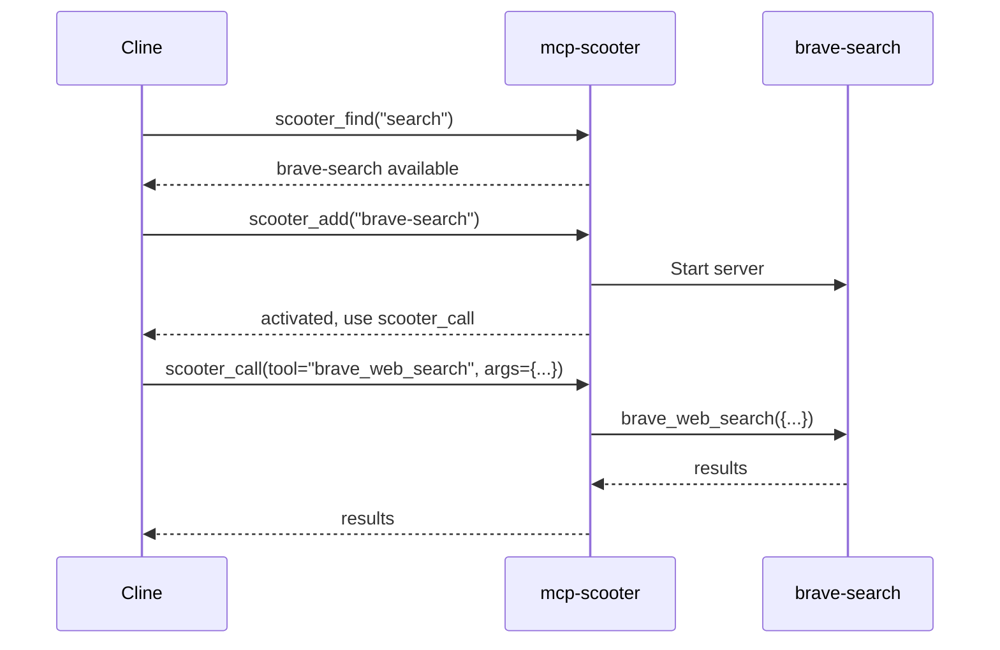

# scooter_call Wrapper Tool Implementation

## Problem Context

When testing MCP Scooter with Cline (VS Code extension), we discovered a fundamental architectural mismatch:

1. After `scooter_add("brave-search")` activates the Brave Search server, MCP Scooter correctly:

                        - Starts the backend server
                        - Sends `tools/list_changed` notification
                        - Returns `brave_web_search` in the tools list

2. However, Cline incorrectly routes `brave_web_search` calls to a non-existent `brave-search` server instead of `mcp-scooter`

3. The MCP protocol has a 1:1 relationship between servers and tools - clients aren't designed to understand proxy patterns

**Evidence from logs:** After `scooter_add` succeeds, the `brave_web_search` call never reaches MCP Scooter - Cline sends it elsewhere.

## Solution: Wrapper Tool Pattern

Add `scooter_call` - an explicit wrapper tool that routes all backend tool calls through MCP Scooter:

```
Instead of: brave_web_search({query: "AI news"})  // Cline routes to wrong server
Use: scooter_call({tool: "brave_web_search", arguments: {query: "AI news"}})  // Always goes to mcp-scooter
```


## Implementation Details

### 1. Add `scooter_call` to Primordial Tools

**File:** [internal/domain/discovery/builtin.go](internal/domain/discovery/builtin.go)

Add new tool definition after `scooter_list_active`:

```go
{
    Name:        "scooter_call",
    Title:       "Call Tool",
    Description: "Execute any activated tool through the MCP Scooter gateway.",
    Category:    "system",
    Source:      "builtin",
    Installed:   true,
    Tools: []registry.Tool{
        {
            Name:        "scooter_call",
            Description: "Execute any activated tool. After using scooter_add to activate a server, use this to call its tools. Example: scooter_call({tool: 'brave_web_search', arguments: {query: 'AI news'}})",
            InputSchema: &registry.JSONSchema{
                Type: "object",
                Properties: map[string]registry.PropertySchema{
                    "tool": {
                        Type:        "string",
                        Description: "The name of the tool to call (e.g., 'brave_web_search', 'search_repositories')",
                    },
                    "arguments": {
                        Type:        "object",
                        Description: "Arguments to pass to the tool",
                    },
                },
                Required: []string{"tool"},
            },
        },
    },
},
```

### 2. Implement `scooter_call` Handler

**File:** [internal/domain/discovery/builtin.go](internal/domain/discovery/builtin.go)

Add case in `HandleBuiltinTool` switch statement:

```go
case "scooter_call":
    toolName, ok := params["tool"].(string)
    if !ok || toolName == "" {
        return nil, fmt.Errorf("tool name is required")
    }
    arguments, _ := params["arguments"].(map[string]interface{})
    if arguments == nil {
        arguments = make(map[string]interface{})
    }
    
    // Delegate to CallTool which handles both builtin and activated tools
    return e.CallTool(toolName, arguments)
```

### 3. Update `scooter_add` Response

**File:** [internal/domain/discovery/builtin.go](internal/domain/discovery/builtin.go)

Modify the response to guide agents toward using `scooter_call`:

```go
return map[string]interface{}{
    "status":          "activated",
    "backend_server":  tool,
    "available_tools": toolNames,
    "message":         fmt.Sprintf("SUCCESS: Tools activated: %v", toolNames),
    "usage":           fmt.Sprintf("Use scooter_call({tool: '%s', arguments: {...}}) to execute these tools.", toolNames[0]),
    "important":       "Always use scooter_call to invoke these tools - do NOT call them directly.",
}, nil
```

### 4. Update PRD Documentation

**File:** [.doc/prd.md](.doc/prd.md)

Update Section 5.1 "The Meta-Layer" to add `scooter_call`:

- Add `scooter_call` to the list of 8 Primordial Tools (was 7)
- Document the wrapper pattern and why it exists
- Update the "Tool Activation Flow" to show `scooter_call` usage

### 5. Update Test Scenarios

**File:** [tests/scenarios/definitions/builtin_tools.yaml](tests/scenarios/definitions/builtin_tools.yaml)

- Update `tools_contain` to include `scooter_call`
- Change `scooter_execute` to `scooter_ai_route` (already renamed)

**File:** [tests/scenarios/definitions/tool_lifecycle.yaml](tests/scenarios/definitions/tool_lifecycle.yaml)

- Add step to test `scooter_call` after activation:
```yaml
- name: call_via_wrapper
  action: call_tool
  tool: scooter_call
  args:
    tool: "search_repositories"
    arguments:
      query: "mcp"
  expect:
    error: null
```


### 6. Add Unit Test for scooter_call

**File:** [internal/domain/discovery/scooter_test.go](internal/domain/discovery/scooter_test.go)

Add test for the new wrapper tool functionality.

### 7. Update Evaluation Scenarios

**File:** [tests/evaluation/scenarios.yaml](tests/evaluation/scenarios.yaml)

Update the evaluation scenarios to use `scooter_call` pattern. The scenarios test natural language tasks where the agent must figure out which tools to use:

```yaml
scenarios:
 - id: web-search-natural
    name: "Natural Web Search"
    description: "Tests if the agent can discover, add, and use a search tool via scooter_call."
    task: "What company created the Model Context Protocol (MCP) and when was it announced?"
    validation:
      required_tool_patterns: ["scooter_find", "scooter_add", "scooter_call"]
      expected_tool_patterns: ["*search*"]
      response_must_contain: ["Anthropic"]
```

### 8. Update Evaluation Prompt

**File:** [tests/evaluation/run_evaluation.py](tests/evaluation/run_evaluation.py)

Update the `EVALUATION_PROMPT` to teach the agent about `scooter_call`:

````python
## TOOL DISCOVERY WORKFLOW

1. **Check active tools first**: Use `scooter_list_active` to see what's already available.
2. **Search for tools**: Use `scooter_find` with a query like "search" or "github" to discover tools.
3. **Add tools**: Use `scooter_add` with the SERVER NAME (e.g., "brave-search", NOT "brave_web_search").
4. **Use tools via scooter_call**: After adding, use `scooter_call` to invoke the tool:
   ```json
   {"tool": "brave_web_search", "arguments": {"query": "your search"}}
   ```

## CRITICAL: USING scooter_call

After activating a server with `scooter_add`, you MUST use `scooter_call` to invoke its tools:

### scooter_call (ALWAYS use this for activated tools)
```json
{"tool": "brave_web_search", "arguments": {"query": "AI news", "count": 5}}
````

- Required: `tool` (string) - The tool name to call
- Optional: `arguments` (object) - Arguments for the tool
````

### 9. Update Test Agent Command

**File:** [.cursor/commands/test-agent.md](.cursor/commands/test-agent.md)

Update the validation criteria to include `scooter_call`:

```markdown
**Validation:**
- Agent uses `scooter_find` to discover capabilities.
- Agent uses `scooter_add` to activate necessary tools.
- Agent uses `scooter_call` to invoke activated tools.
- Agent completes the end-to-end task (e.g., search web, find repository).
````


## Files to Modify

| File | Changes |

|------|---------|

| `internal/domain/discovery/builtin.go` | Add `scooter_call` definition and handler |

| `.doc/prd.md` | Update primordial tools list, document wrapper pattern |

| `tests/scenarios/definitions/builtin_tools.yaml` | Add `scooter_call` to expected tools, fix `scooter_ai_route` |

| `tests/scenarios/definitions/tool_lifecycle.yaml` | Add `scooter_call` test step |

| `internal/domain/discovery/scooter_test.go` | Add unit test for `scooter_call` |

| `tests/evaluation/scenarios.yaml` | Update validation to require `scooter_call` |

| `tests/evaluation/run_evaluation.py` | Update EVALUATION_PROMPT with `scooter_call` instructions |

| `.cursor/commands/test-agent.md` | Update validation criteria |

## Expected Outcome

After implementation:

1. AI agents will use `scooter_call` to invoke activated tools
2. All tool calls will route through `mcp-scooter` (no routing confusion)
3. The dynamic loading benefits are preserved (context bloat prevention)
4. Tests will verify the new workflow works correctly
5. Evaluation scenarios will validate the complete `scooter_call` workflow