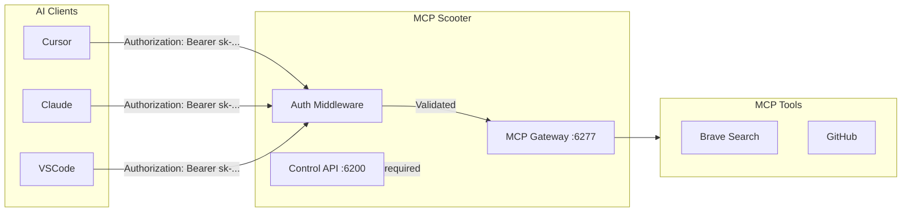

# Secure MCP Scooter API and Improve Profile Documentation

## Overview

This plan addresses three goals:

1. **Secure the MCP Gateway** with API key authentication (IDE-to-Scooter communication)
2. **Rename and document** the confusing `auth_mode` field in Profile
3. **Update the Desktop UI** to manage the new security settings

---

## Architecture



---

## Part 1: Backend Changes

### 1.1 Add API Key to Settings

**File:** [internal/domain/profile/settings.go](internal/domain/profile/settings.go)

Add a new field for the gateway API key:

```go
type Settings struct {
    ControlPort   int    `yaml:"control_port" json:"control_port"`
    McpPort       int    `yaml:"mcp_port" json:"mcp_port"`
    EnableBeta    bool   `yaml:"enable_beta" json:"enable_beta"`
    GatewayAPIKey string `yaml:"gateway_api_key" json:"gateway_api_key"` // NEW
}
```

Add a helper function to generate a secure key:

```go
func GenerateAPIKey() string {
    b := make([]byte, 24)
    rand.Read(b)
    return "sk-scooter-" + base64.RawURLEncoding.EncodeToString(b)
}
```

### 1.2 Add Authentication Middleware to MCP Gateway

**File:** [internal/api/server.go](internal/api/server.go)

- Add a `settings` field to `McpGateway` struct
- Create `requireGatewayAuth` middleware that:
                                - Skips auth if `GatewayAPIKey` is empty (backwards compatible)
                                - Checks `Authorization: Bearer <key>` header
                                - Falls back to `X-Scooter-API-Key` header
                                - Returns 401 Unauthorized if key doesn't match
- Update CORS to allow the `Authorization` header
- Wrap SSE and message handlers with the middleware

### 1.3 Update All Integration Configurations

**Files:**

- [internal/domain/integration/cursor.go](internal/domain/integration/cursor.go)
- [internal/domain/integration/claude.go](internal/domain/integration/claude.go)
- [internal/domain/integration/vscode.go](internal/domain/integration/vscode.go)
- [internal/domain/integration/zed.go](internal/domain/integration/zed.go)
- [internal/domain/integration/gemini.go](internal/domain/integration/gemini.go)
- [internal/domain/integration/codex.go](internal/domain/integration/codex.go)

Update each `Configure` function signature to accept the API key:

```go
func (c *CursorIntegration) Configure(port int, profileID string, apiKey string) error
```

When `apiKey` is non-empty, include it in the client configuration:

```go
serverConfig := map[string]interface{}{
    "type": "sse",
    "url":  url,
}
if apiKey != "" {
    serverConfig["headers"] = map[string]string{
        "Authorization": "Bearer " + apiKey,
    }
}
```

### 1.4 Update handleInstallIntegration

**File:** [internal/api/server.go](internal/api/server.go)

Pass `s.settings.GatewayAPIKey` to each integration's Configure method.

---

## Part 2: Rename and Document Profile Fields

### 2.1 Rename `auth_mode` to `remote_auth_mode`

**File:** [internal/domain/profile/profile.go](internal/domain/profile/profile.go)

Rename and add comprehensive documentation:

```go
type Profile struct {
    // ID is the unique identifier for the profile (e.g., "work", "personal")
    ID string `yaml:"id" json:"id"`

    // RemoteAuthMode specifies how to authenticate when proxying to a remote MCP server.
    // This is NOT for IDE-to-Scooter authentication (use Settings.GatewayAPIKey for that).
    // Valid values: "none", "oauth2", "api_key"
    // Only used when RemoteServerURL is set.
    RemoteAuthMode string `yaml:"remote_auth_mode" json:"remote_auth_mode"`

    // RemoteServerURL is the URL of a remote MCP server to proxy requests to.
    // When set, Scooter acts as a proxy and uses RemoteAuthMode to authenticate.
    // Example: "https://mcp.acme-corp.com/gateway"
    RemoteServerURL string `yaml:"remote_server_url" json:"remote_server_url"`

    // Env contains environment variables injected into tool processes.
    // Use this for tool-specific API keys (e.g., BRAVE_API_KEY, GITHUB_TOKEN).
    Env map[string]string `yaml:"env" json:"env"`

    // AllowTools is the list of tool names enabled for this profile.
    AllowTools []string `yaml:"allow_tools" json:"allow_tools"`
}
```

### 2.2 Update All References

- [internal/api/server.go](internal/api/server.go) - Update onboarding handler
- [desktop/src/App.tsx](desktop/src/App.tsx) - Update TypeScript interface and createProfile

---

## Part 3: Desktop UI Updates

### 3.1 Update TypeScript Interfaces

**File:** [desktop/src/App.tsx](desktop/src/App.tsx)

```typescript
interface Settings {
  control_port: number;
  mcp_port: number;
  enable_beta: boolean;
  gateway_api_key: string; // NEW
}

interface Profile {
  id: string;
  remote_auth_mode: string; // RENAMED
  remote_server_url: string;
  env: Record<string, string>;
  allow_tools: string[];
}
```

### 3.2 Add Security Section to Settings Modal

**File:** [desktop/src/components/SettingsModal.tsx](desktop/src/components/SettingsModal.tsx)

Add a new "Security" section with:

- Display of current API key (masked by default, with reveal toggle)
- "Regenerate Key" button
- "Copy to Clipboard" button
- Warning text explaining that regenerating will require re-syncing all clients
- Visual indicator showing if security is enabled (key set) or disabled (no key)
```
+------------------------------------------+
| Security                                 |
+------------------------------------------+
| Gateway API Key                          |
| [sk-scooter-**********************] [👁] |
|                                          |
| [Copy] [Regenerate]                      |
|                                          |
| ⚠️ Regenerating will disconnect all      |
|    synced clients until re-synced.       |
+------------------------------------------+
```


### 3.3 Update Client Sync Flow

**File:** [desktop/src/App.tsx](desktop/src/App.tsx)

After syncing a client, if `gateway_api_key` is set, show a success message indicating the client was configured with authentication.

---

## Part 4: Auto-Generation Logic

### 4.1 Generate Key on First Run (Optional)

**File:** [internal/domain/profile/store.go](internal/domain/profile/store.go)

In the `Load` function, if the file exists but `GatewayAPIKey` is empty, optionally auto-generate one. However, since user selected "allow customization", we'll leave it empty by default and let users generate via UI.

### 4.2 Add API Endpoint for Key Regeneration

**File:** [internal/api/server.go](internal/api/server.go)

Add a new endpoint:

```go
s.mux.HandleFunc("POST /api/settings/regenerate-key", s.handleRegenerateKey)
```

This endpoint:

- Generates a new key using `profile.GenerateAPIKey()`
- Updates settings
- Saves to disk
- Returns the new key

---

## Files Changed Summary

| File | Changes |

|------|---------|

| `internal/domain/profile/settings.go` | Add `GatewayAPIKey` field, add `GenerateAPIKey()` function |

| `internal/domain/profile/profile.go` | Rename `AuthMode` to `RemoteAuthMode`, add documentation |

| `internal/api/server.go` | Add auth middleware, update gateway, add regenerate endpoint |

| `internal/domain/integration/*.go` | Update Configure signatures to accept API key |

| `desktop/src/App.tsx` | Update interfaces, update createProfile |

| `desktop/src/components/SettingsModal.tsx` | Add Security section with key management UI |

---

## Example profiles.yaml After Implementation

```yaml
settings:
  control_port: 6200
  mcp_port: 6277
  enable_beta: false
  gateway_api_key: "sk-scooter-abc123xyz789..."  # Secures IDE connections

profiles:
  - id: work
    remote_auth_mode: oauth2           # For remote MCP proxy (renamed from auth_mode)
    remote_server_url: "https://mcp.company.com"
    env:
      BRAVE_API_KEY: "BSA..."          # Tool-specific credentials
    allow_tools:
      - brave-search
```